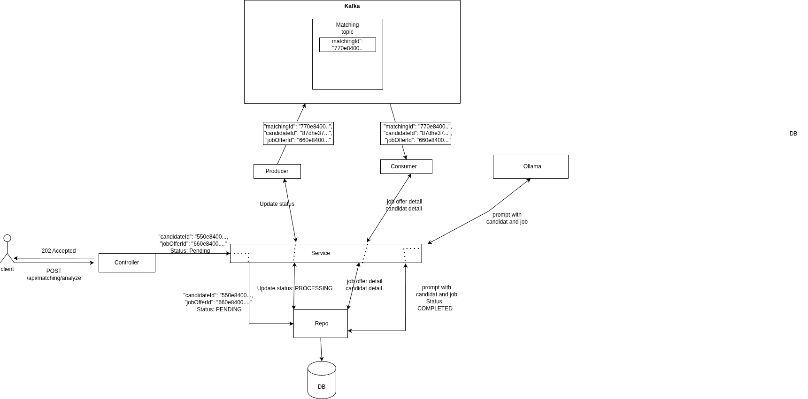

# TalentMatchAI

Projet réalisé dans le cadre du cours de **Programmation par Composants** (Spring Boot).

TalentMatchAI est une API REST qui met en relation des candidats avec des offres d'emploi en s'appuyant sur une analyse IA. Lorsqu'une demande de matching est soumise, elle est publiée sur un topic Kafka, consommée de manière asynchrone, puis analysée par un LLM local (Ollama) qui retourne un score de compatibilité et une analyse textuelle.

---

## Présentation

### Services tiers utilisés

| Service | Rôle |
|---|---|
| **Apache Kafka** | Bus de messages asynchrone — découple la réception des demandes de matching de leur traitement IA |
| **Ollama** (modèle `llama3.2:3b`) | LLM local — analyse la compatibilité candidat/offre et produit un score sur 100 avec justification |
| **GitHub API** | Import de candidats via leur profil GitHub (`/candidates/import`) |
| **H2** | Base de données en mémoire pour la persistance des candidats, offres et résultats de matching |

### Architecture



Le diagramme décrit les trois domaines principaux (`Candidate`, `JobOffer`, `Matching`) et leurs interactions avec les services tiers via Kafka et les clients HTTP (Ollama, GitHub API).

---

## Lancer le projet en local

### Prérequis

- Java 21
- Maven
- Docker & Docker Compose

### 1. Démarrer les services tiers

```bash
docker compose up -d
```

Cela démarre :
- **Kafka** sur le port `9092`
- **Ollama** sur le port `11434` (le modèle `llama3.2:3b` est téléchargé automatiquement au premier démarrage — prévoir quelques minutes)

### 2. Lancer l'application Spring Boot

```bash
./mvnw spring-boot:run
```

L'API est disponible sur `http://localhost:8080`.

La console H2 est accessible sur `http://localhost:8080/h2-console`
(JDBC URL : `jdbc:h2:mem:talentmatchdb`, utilisateur : `sa`, mot de passe : vide)

### 3. Tester le pipeline complet

```bash
bash e2e-test.sh
```

Le script crée un candidat, trois offres d'emploi, lance les analyses de matching et affiche les scores.

---

## Endpoints principaux

### Candidats — `/candidates`

| Méthode | Route | Description |
|---|---|---|
| `POST` | `/candidates` | Créer un candidat |
| `GET` | `/candidates` | Lister tous les candidats |
| `GET` | `/candidates/{id}` | Récupérer un candidat |
| `PUT` | `/candidates/{id}` | Mettre à jour un candidat |
| `DELETE` | `/candidates/{id}` | Supprimer un candidat |
| `POST` | `/candidates/import` | Importer depuis un profil GitHub |

### Offres d'emploi — `/job-offers`

| Méthode | Route | Description |
|---|---|---|
| `POST` | `/job-offers` | Créer une offre |
| `GET` | `/job-offers` | Lister toutes les offres |
| `GET` | `/job-offers/{id}` | Récupérer une offre |
| `PUT` | `/job-offers/{id}` | Mettre à jour une offre |
| `DELETE` | `/job-offers/{id}` | Supprimer une offre |

### Matching — `/matching`

| Méthode | Route | Description |
|---|---|---|
| `POST` | `/matching/analyze` | Lancer une analyse (asynchrone via Kafka) |
| `GET` | `/matching/results` | Lister tous les résultats |
| `GET` | `/matching/results/{id}` | Récupérer un résultat |
| `GET` | `/matching/candidate/{candidateId}` | Résultats par candidat |
| `GET` | `/matching/job/{jobOfferId}` | Résultats par offre |


